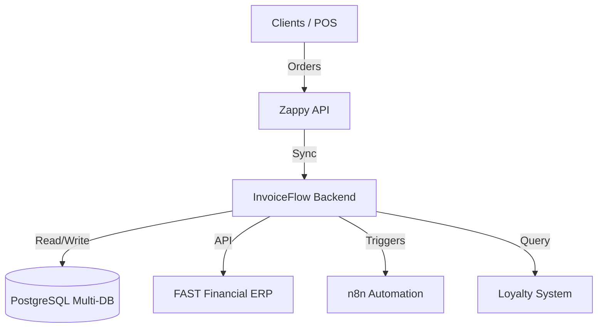

# System Architecture

## 1. High-Level Design

**InvoiceFlow** is a Middleware System integrated into a larger Microservices-like ecosystem.

## 2. Data Flow Architecture

### A. Ingestion (Sync)

- **Pull Mechanism**: `SyncService` pulls data (Products, Stock) from Zappy/FAST.
- **Push Mechanism**: Webhooks from upstream systems trigger Controllers.

### B. Processing (Core)

- **Order Routing**: Orders are classified (Service vs Retail) in `SalesInvoiceService`.
- **Enrichment**:
  - Customer info from `LoyaltyService`.
  - Discount/Voucher data from `Promotion` tables.
- **Validation**: Checked against `InvoiceValidationService` rules.

### C. Egress (Execution)

- **FAST Integration**: `FastApiInvoiceFlowService` pushes validated data to ERP.
- **Audit Logging**: Every attempt/response is logged to `fast_api_invoices` table.

## 3. Data Model Strategy

- **Entities**: TypeORM entities mirror the business objects.
- **Multi-Tenancy**: The application supports multiple database schemas dynamically via `MultiDbService` (if applicable), allowing distinct data isolation per branch/region.

## 4. Infrastructure

- **Node.js/NestJS**: Scalable, module-based backend.
- **PostgreSQL**: Relational integrity for financial data.
- **Redis (Optional)**: Caching for frequent catalog lookups (Products/Prices).
